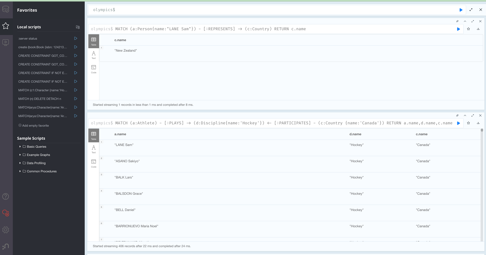
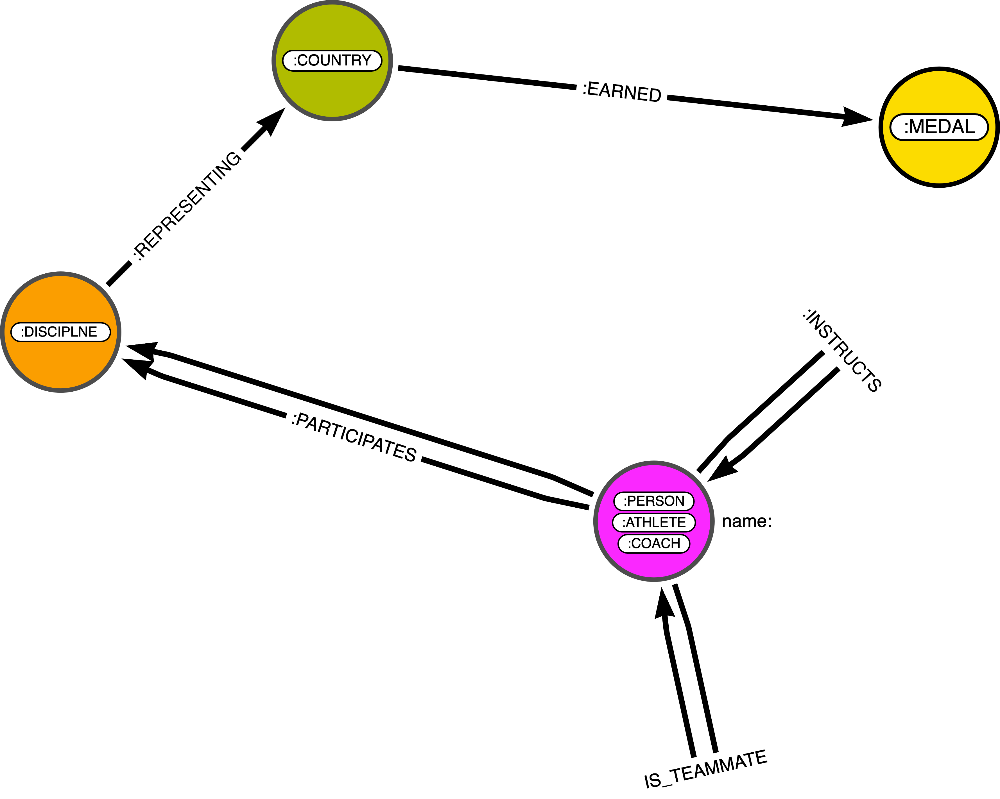
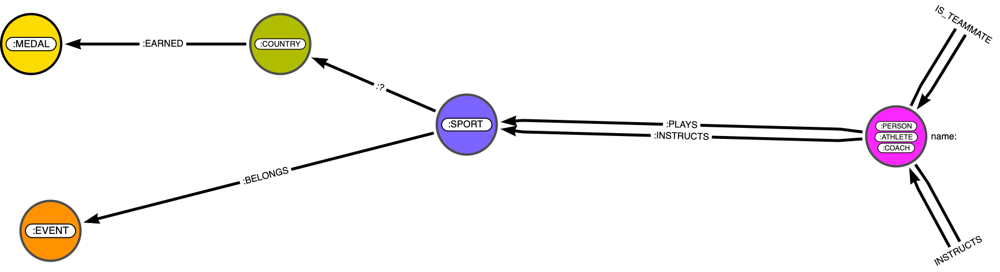

# Olympics Demo  

## Introduction

First attempt at creating a Neo4j Graph from multiple, disparate/disjointed data sources (in this case multiple csv files with common fields). 

* Logic is all written in Cypher (/Cypher) 
* Orchestrated externally via apache airflow 

## Issues:

* Python script (util/xmlConverter) to convert xslx is broken. Actually more of a pain than I had considered changing the encoding to be. Abandoned & manually converted
*  The data model doesn't seem to be right... 
*  The data was loaded improperly and isn't consistent/correct (see screenshot below)

## Business Questions Looking to Answer: 

* Who Coaches for a Particular Sport and A Particular Country?
* Countries Participating in the Most Sports, With the highest medal counts?
* Are there any coaches that are also atheletes?

## Data Model

## Alternative Data Models

